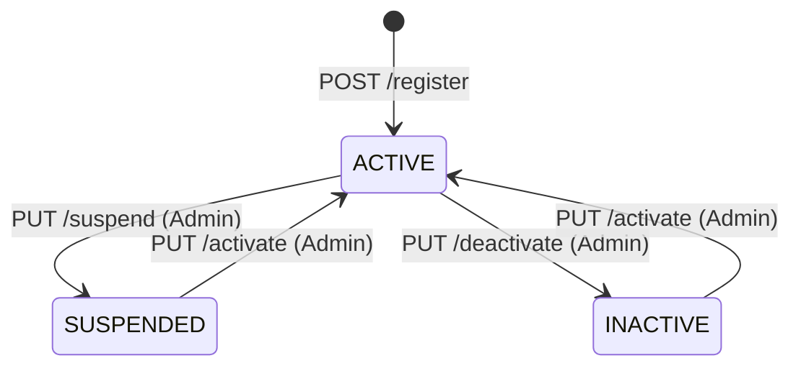
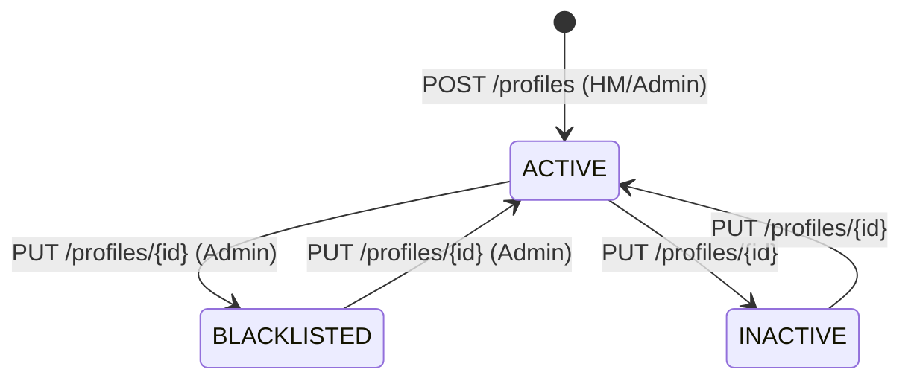
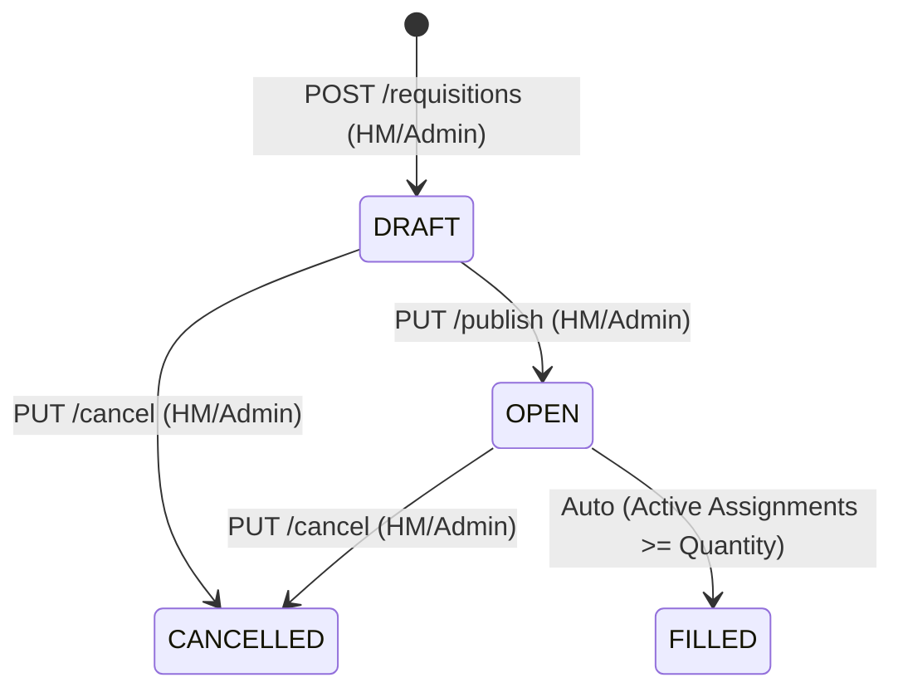
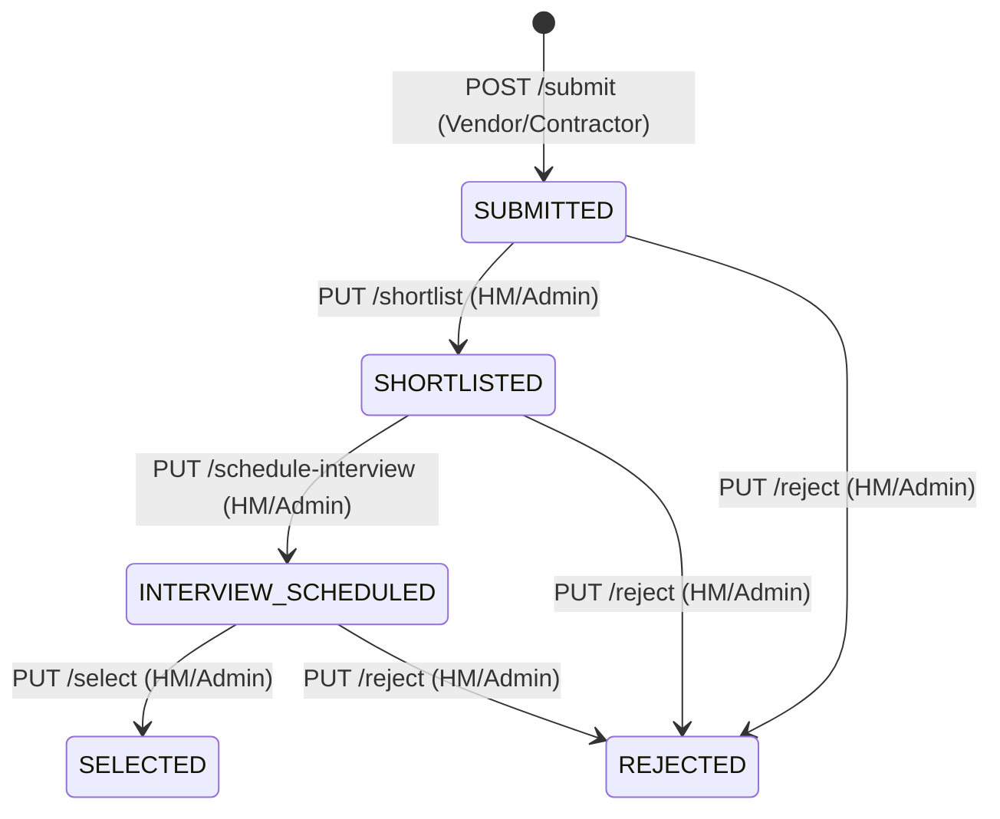
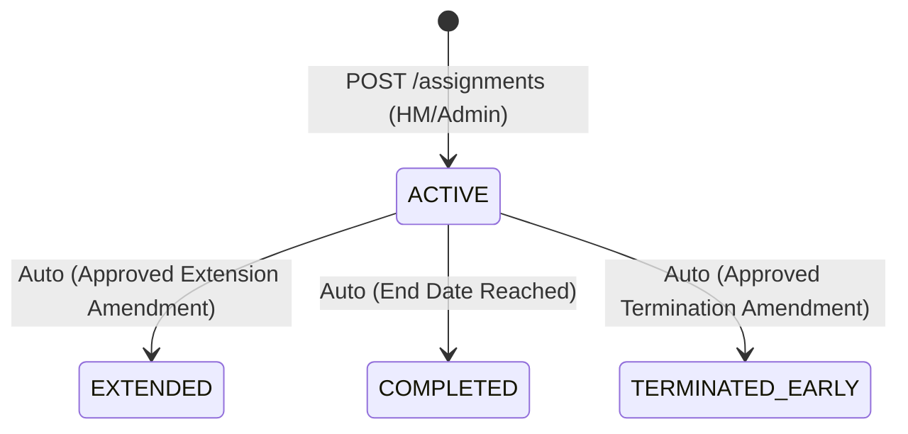
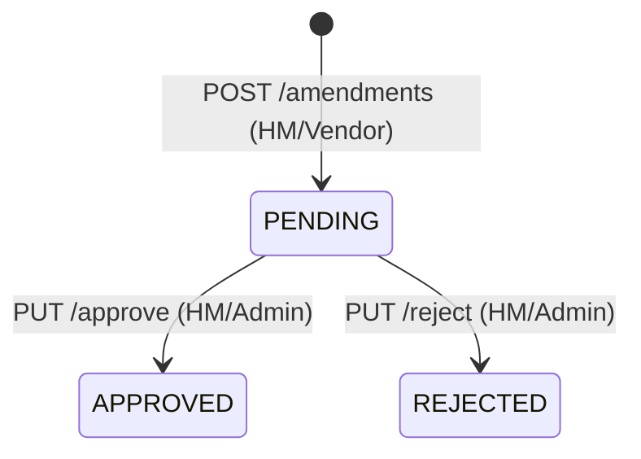
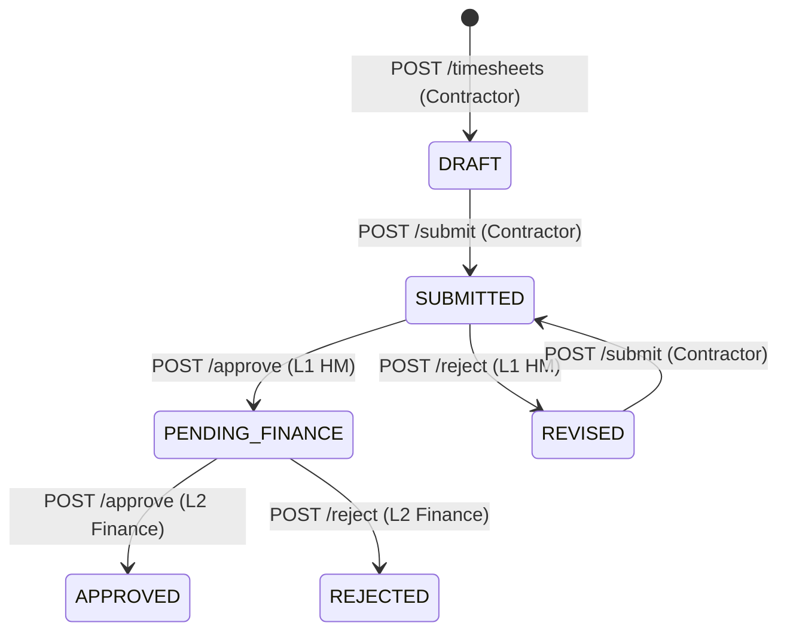
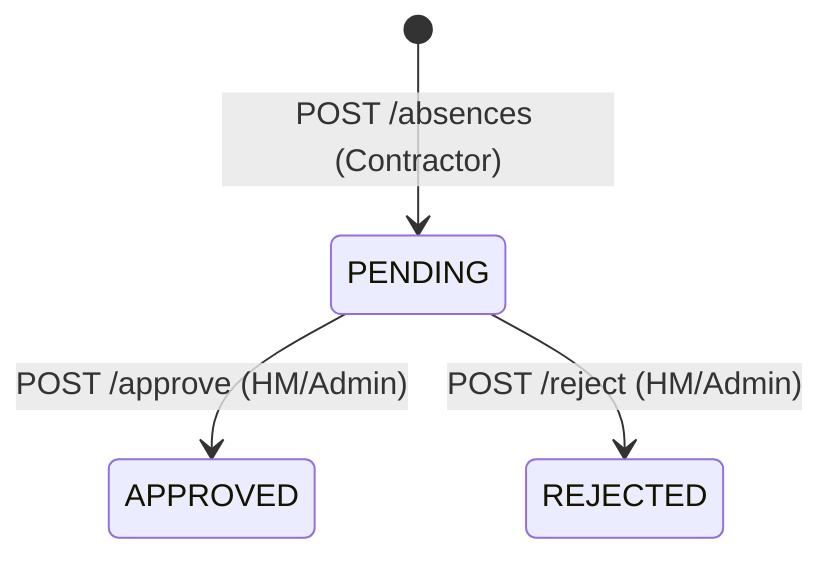

# Business Workflow and State Transition Audit Report

This report documents the step-by-step lifecycles, state transitions, business rules, and roles responsible for each core workflow in the GigForce platform.

---

## 1. User Lifecycle

* **Role Responsible:** Admin (transitions), All Users (registration).
* **Business Rules:**
  * Suspension prevents authentication (`POST /auth/login` checks user status).
  * Deactivation blocks the user from active assignments and listings.

---

## 2. Contractor Profile Lifecycle

* **Role Responsible:** Hiring Manager / Admin (creation), Contractor / Admin (updates).
* **Business Rules:**
  * Profile creation requires a pre-existing User in `ACTIVE` state with the `CONTRACTOR` role.
  * Mapped skills and certifications inherit access control (only owner or Admin can write).
  * Blacklisted contractors cannot be submitted to new requisitions or assigned.

---

## 3. Resource Requisition Lifecycle

* **Role Responsible:** Hiring Manager / Admin.
* **Business Rules:**
  * Requisitions can only be updated/edited while in `DRAFT` status.
  * Publishing transitions state from `DRAFT` $\rightarrow$ `OPEN`, making the requisition visible to Vendors.
  * Transitions to `FILLED` automatically once active assignments matching selected vendor submissions reach the requested quantity.

---

## 4. Vendor Submission Lifecycle

* **Role Responsible:** Vendor / Contractor (submission), Hiring Manager / Admin (review/selection).
* **Business Rules:**
  * Only open, active contractor profiles can be submitted to `OPEN` requisitions.
  * Submissions must have unique requisition-contractor pairings (enforced by DB composite unique constraint).
  * Transition to `SELECTED` enables assignment generation.

---

## 5. Assignment Lifecycle

* **Role Responsible:** Hiring Manager / Admin.
* **Business Rules:**
  * Assignments are generated from a `SELECTED` vendor submission.
  * Creating an assignment updates the contractor availability: `AVAILABLE` $\rightarrow$ `ON_ASSIGNMENT`.
  * Amendments can extend the end date (`EXTENDED`) or cause early closure (`TERMINATED_EARLY`). On termination/completion, contractor status transitions back to `AVAILABLE`.

---

## 6. Assignment Amendment Lifecycle

* **Role Responsible:** Hiring Manager / Vendor (request), Hiring Manager / Admin (approval).
* **Business Rules:**
  * Only one pending amendment can exist for an assignment at a time.
  * Approving the amendment updates the underlying assignment rates, dates, or status automatically.

---

## 7. Timesheet Lifecycle

* **Role Responsible:** Contractor (draft, submit), Hiring Manager (L1 Review), Finance (L2 Audit/Payroll).
* **Business Rules:**
  * Weekly timesheets are logged Monday to Sunday. Only one timesheet can exist per contractor-assignment-week.
  * L1 approval checks: total daily hours $\le 8$ regular, $\le 24$ total; weekly hours $\le 40$ regular, $\le 60$ total.
  * L2 approval: verifies billing rate and updates status to `APPROVED`.
  * Payroll sweeps process `APPROVED` and `NOT_PROCESSED` timesheets.

---

## 8. Contractor Leave Lifecycle

* **Role Responsible:** Contractor (request), Hiring Manager / Admin (review).
* **Business Rules:**
  * Cannot request leave for dates outside the active assignment range.
  * Overlapping leave requests for the same contractor are blocked.
  * Approving leave updates overlapping timesheet lines (forces 0 billable hours for full-day leaves, and restricts worked hours to $\le 4$ hours for half-day leaves).
