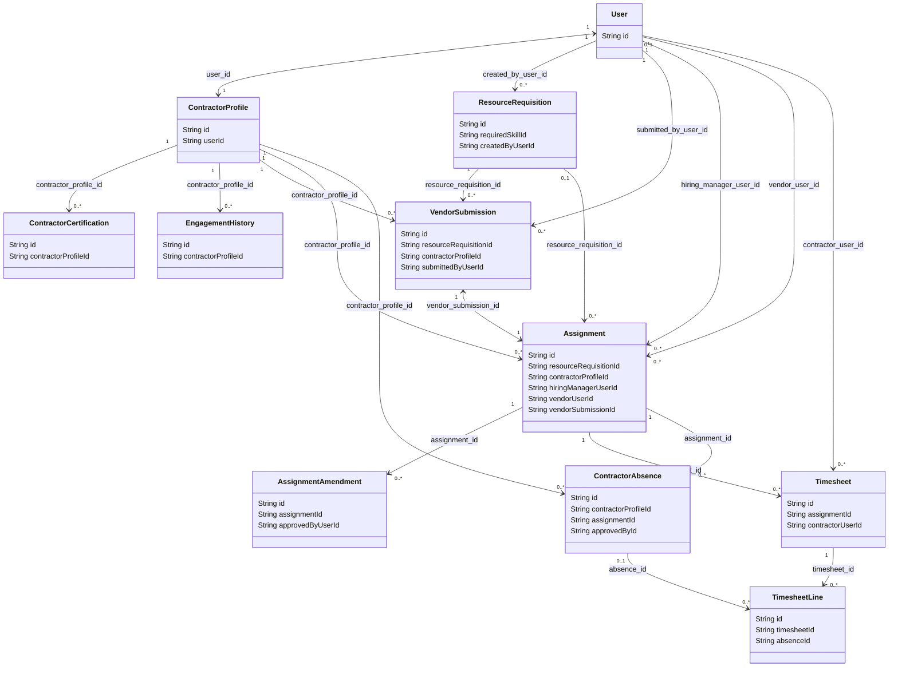

# GigForce Compliance and Audit Report

This audit report thoroughly reviews the entire GigForce implementation against the user requirements for Modules 4.1 through 4.5. It evaluates database schemas, ID generation rules, entity relationships, API coverage, business workflows, role-based access control (RBAC), security controls, Postman collections, and test suites.

---

## 1. Database Verification

The database schema is auto-generated by Hibernate from JPA entities mapped to a MySQL database. Below is a comprehensive audit of all fields, data types, primary keys, foreign keys, indexes, and unique constraints.

### Module 4.1 – Identity & Access Management

#### User Entity
* **Java Class:** [User.java](file:///c:/Users/HP/Downloads/gigforce_1/src/main/java/com/gigforce/identity/entity/User.java)
* **Table Name:** `users`
* **Audit Result:** **1 Field Missing** (`OrgUnitID`).
* **Verification Detail:**
  * `UserID`: Mapped as primary key column `user_id` (varchar(64)) inheriting from `BaseEntity`.
  * `Name`: Mapped as `name` column (varchar(100), not null).
  * `Role`: Mapped as `role` column (varchar(30), not null) using `UserRole` enum.
  * `Email`: Mapped as `email` column (varchar(255), not null, unique).
  * `Phone`: Mapped as `phone` column (varchar(20), nullable).
  * `OrgUnitID`: **MISSING** (No column or field exists).
  * `Status`: Mapped as `status` column (varchar(20), not null) using `UserStatus` enum.
  * **Extra Fields:** `password` (varchar(255), not null) used for security login.
  * **Indexes:** `idx_user_email` on `email`, `idx_user_role` on `role`, `idx_user_status` on `status`.
  * **Unique Constraints:** Unique index on `email`.

#### AuditLog Entity
* **Java Class:** [AuditLog.java](file:///c:/Users/HP/Downloads/gigforce_1/src/main/java/com/gigforce/audit/entity/AuditLog.java)
* **Table Name:** `audit_logs`
* **Audit Result:** **Fully Compliant** (100% fields exist).
* **Verification Detail:**
  * `AuditID`: Mapped as primary key column `audit_id` (varchar(64)) via `@AttributeOverride`.
  * `UserID`: Mapped as `user_id` column (varchar(255), nullable).
  * `Action`: Mapped as `action` column (varchar(100), not null).
  * `EntityType`: Mapped as `entity_type` column (varchar(50), not null).
  * `Timestamp`: Mapped as `timestamp` column (datetime(6), not null) via `@AttributeOverride` of base `createdAt` column, exposed through `getTimestamp()`.
  * **Extra Fields:** `entity_id` (varchar(255)), `description` (varchar(500)).
  * **Indexes:** `idx_audit_user_id` on `user_id`, `idx_audit_timestamp` on `timestamp`.

---

### Module 4.2 – Contractor Profile & Skill Management

#### ContractorProfile Entity
* **Java Class:** [ContractorProfile.java](file:///c:/Users/HP/Downloads/gigforce_1/src/main/java/com/gigforce/identity/entity/ContractorProfile.java)
* **Table Name:** `contractor_profiles`
* **Audit Result:** **4 Fields Missing as Flat Columns** (`DisplayName`, `PrimarySkill`, `SkillTags`, `PreferredEngagementType`).
* **Verification Detail:**
  * `ContractorID`: Mapped as primary key column `contractor_profile_id` (varchar(64)) via `@AttributeOverride`.
  * `UserID`: Mapped as `user_id` column (varchar(64), unique, foreign key).
  * `DisplayName`: **MISSING** (Omitted; name is fetched dynamically from the linked `User` record).
  * `PrimarySkill`: **MISSING** (Skills are normalized into child table `contractor_skills`).
  * `SkillTags`: **MISSING** (No flat column; tags are not implemented).
  * `ExperienceYears`: Mapped as `experience_years` column (int, not null).
  * `PreferredEngagementType`: **MISSING** (Preferred engagement type Remote/Onsite/Hybrid is omitted on profile level).
  * `AvailabilityStatus`: Mapped as `availability_status` column (varchar(30), not null) using `AvailabilityStatus` enum.
    * *Gap:* Uses `ON_STATUS` value instead of `OnNotice`.
  * `Status`: Mapped as `profile_status` column (varchar(30), not null) using `ProfileStatus` enum.
  * **Extra Fields:** `hourly_rate` column (decimal(10,2), not null) for contract billing.
  * **Indexes:** `idx_contractor_user_id` on `user_id`, `idx_contractor_status` on `profile_status`.
  * **Unique Constraints:** Unique key on `user_id`.

> [!NOTE]
> Skill tags and primary skills are represented relationally through [ContractorSkill.java](file:///c:/Users/HP/Downloads/gigforce_1/src/main/java/com/gigforce/identity/entity/ContractorSkill.java) which maps `ContractorProfile` to a specific [Skill.java](file:///c:/Users/HP/Downloads/gigforce_1/src/main/java/com/gigforce/identity/entity/Skill.java) with a `proficiency_level` and `years_of_experience`.

#### ContractorCertification Entity
* **Java Class:** [ContractorCertification.java](file:///c:/Users/HP/Downloads/gigforce_1/src/main/java/com/gigforce/identity/entity/ContractorCertification.java)
* **Table Name:** `contractor_certifications`
* **Audit Result:** **Fully Compliant** (100% fields exist).
* **Verification Detail:**
  * `CertID`: Mapped as primary key column `certification_id` (varchar(64)) via `@AttributeOverride`.
  * `ContractorID`: Mapped as foreign key column `contractor_profile_id` (varchar(64), not null) referencing `contractor_profiles`.
  * `CertificationName`: Mapped as `name` column (varchar(150), not null).
  * `IssuingBody`: Mapped as `issuing_authority` column (varchar(150), not null).
  * `IssuedDate`: Mapped as `issue_date` column (date, not null).
  * `ExpiryDate`: Mapped as `expiry_date` column (date, nullable).
  * `Status`: Mapped as `cert_status` column (varchar(20)) using `CertificationStatus` enum (`VALID`, `EXPIRED`, `REVOKED`).
  * **Extra Fields:** `certificate_number` (varchar(100), nullable).
  * **Indexes:** `idx_cert_profile_id` on `contractor_profile_id`.

#### EngagementHistory Entity
* **Java Class:** [EngagementHistory.java](file:///c:/Users/HP/Downloads/gigforce_1/src/main/java/com/gigforce/identity/entity/EngagementHistory.java)
* **Table Name:** `engagement_histories`
* **Audit Result:** **Fully Compliant** (100% fields exist).
* **Verification Detail:**
  * `HistoryID`: Mapped as primary key column `engagement_history_id` (varchar(64)) via `@AttributeOverride`.
  * `ContractorID`: Mapped as foreign key column `contractor_profile_id` (varchar(64), not null) referencing `contractor_profiles`.
  * `ClientName`: Mapped as `client_name` column (varchar(150), not null).
  * `Role`: Mapped as `role_title` column (varchar(150), not null).
  * `StartDate`: Mapped as `start_date` column (date, not null).
  * `EndDate`: Mapped as `end_date` column (date, nullable).
  * `PerformanceRating`: Mapped as `rating` column (int, nullable).
  * `FeedbackSummary`: Mapped as `feedback` column (varchar(500), nullable).
  * **Indexes:** `idx_engagement_profile_id` on `contractor_profile_id`.

---

### Module 4.3 – Resource Requisition & Vendor Sourcing

#### ResourceRequisition Entity
* **Java Class:** [ResourceRequisition.java](file:///c:/Users/HP/Downloads/gigforce_1/src/main/java/com/gigforce/requisition/entity/ResourceRequisition.java)
* **Table Name:** `resource_requisitions`
* **Audit Result:** **1 Field Missing** (`BusinessUnitID`).
* **Verification Detail:**
  * `RequisitionID`: Mapped as primary key column `resource_requisition_id` (varchar(64)) via `@AttributeOverride`.
  * `HiringManagerID`: Mapped as foreign key column `created_by_user_id` (varchar(64), not null) referencing `users`.
  * `BusinessUnitID`: **MISSING** (No column or field exists).
  * `SkillRequired`: Mapped as foreign key column `required_skill_id` (varchar(64), not null) referencing `skills`.
  * `ExperienceLevel`: Mapped as `experience_level` column (varchar(20), not null) using `ExperienceLevel` enum (`JUNIOR`, `MID`, `SENIOR`).
  * `EngagementType`: Mapped as `engagement_type` column (varchar(20), not null) using `EngagementType` enum (`REMOTE`, `ONSITE`, `HYBRID`).
  * `StartDate`: Mapped as `start_date` column (date, not null).
  * `Duration`: Mapped as `duration` column (varchar(50), not null).
  * `MaxRate`: Mapped as `max_hourly_rate` column (decimal(10,2), not null).
  * `Status`: Mapped as `status` column (varchar(30), not null) using `RequisitionStatus` enum.
    * *Gap:* Enum supports `DRAFT`, `OPEN`, `FILLED`, `CANCELLED` but **lacks** `IN_PROGRESS` (InProgress).
  * **Extra Fields:** `title` (varchar(150)), `description` (text), `minExperienceYears` (int), `quantity` (int).
  * **Indexes:** `idx_req_skill_id` on `required_skill_id`, `idx_req_status` on `status`, `idx_req_created_by` on `created_by_user_id`.

#### VendorSubmission Entity
* **Java Class:** [VendorSubmission.java](file:///c:/Users/HP/Downloads/gigforce_1/src/main/java/com/gigforce/requisition/entity/VendorSubmission.java)
* **Table Name:** `vendor_submissions`
* **Audit Result:** **Fully Compliant** (100% fields exist).
* **Verification Detail:**
  * `SubmissionID`: Mapped as primary key column `vendor_submission_id` (varchar(64)) via `@AttributeOverride`.
  * `RequisitionID`: Mapped as foreign key column `resource_requisition_id` (varchar(64), not null) referencing `resource_requisitions`.
  * `VendorID`: Mapped as foreign key column `submitted_by_user_id` (varchar(64), not null) referencing `users` (represents Vendor user ID).
  * `ContractorID`: Mapped as foreign key column `contractor_profile_id` (varchar(64), not null) referencing `contractor_profiles`.
  * `ProposedRate`: Mapped as `proposed_rate` column (decimal(10,2), not null).
  * `SubmissionDate`: Mapped as `submission_date` column (date, not null).
  * `Status`: Mapped as `status` column (varchar(30), not null) using `SubmissionStatus` enum (`SUBMITTED`, `SHORTLISTED`, `INTERVIEW_SCHEDULED`, `SELECTED`, `REJECTED`).
  * **Extra Fields:** `remarks` (varchar(255), nullable).
  * **Indexes:** `idx_sub_req_id` on `resource_requisition_id`, `idx_sub_profile_id` on `contractor_profile_id`, `idx_sub_status` on `status`.
  * **Unique Constraints:** Composite unique constraint `uc_requisition_contractor` on `(resource_requisition_id, contractor_profile_id)`.

---

### Module 4.4 – Assignment & Contract Management

#### Assignment Entity
* **Java Class:** [Assignment.java](file:///c:/Users/HP/Downloads/gigforce_1/src/main/java/com/gigforce/assignment/entity/Assignment.java)
* **Table Name:** `assignments`
* **Audit Result:** **Fully Compliant** (100% fields exist).
* **Verification Detail:**
  * `AssignmentID`: Mapped as primary key column `assignment_id` (varchar(64)) via `@AttributeOverride`.
  * `RequisitionID`: Mapped as foreign key column `resource_requisition_id` (varchar(64), nullable) referencing `resource_requisitions`.
  * `ContractorID`: Mapped as foreign key column `contractor_profile_id` (varchar(64), not null) referencing `contractor_profiles`.
  * `HiringManagerID`: Mapped as foreign key column `hiring_manager_user_id` (varchar(64), not null) referencing `users`.
  * `VendorID`: Mapped as foreign key column `vendor_user_id` (varchar(64), nullable) referencing `users` (Vendor user ID).
  * `StartDate`: Mapped as `start_date` column (date, not null).
  * `EndDate`: Mapped as `end_date` column (date, not null).
  * `AgreedRatePerDay`: Mapped as `agreed_rate_per_day` column (decimal(10,2), not null).
  * `EngagementType`: Mapped as `engagement_type` column (varchar(50), not null).
  * `SOWReference`: Mapped as `sow_reference` column (varchar(150), nullable).
  * `Status`: Mapped as `status` column (varchar(30), not null) using `AssignmentStatus` enum (`ACTIVE`, `EXTENDED`, `COMPLETED`, `TERMINATED_EARLY`).
  * **Extra Fields:** `vendorSubmission` (One-to-One linked column `vendor_submission_id`).
  * **Indexes:** `idx_assign_profile` on `contractor_profile_id`, `idx_assign_status` on `status`, `idx_assign_manager` on `hiring_manager_user_id`, `idx_assign_vendor` on `vendor_user_id`, `idx_assign_submission` on `vendor_submission_id`.
  * **Unique Constraints:** Unique key on `vendor_submission_id`.

#### AssignmentAmendment Entity
* **Java Class:** [AssignmentAmendment.java](file:///c:/Users/HP/Downloads/gigforce_1/src/main/java/com/gigforce/assignment/entity/AssignmentAmendment.java)
* **Table Name:** `assignment_amendments`
* **Audit Result:** **Fully Compliant** (100% fields exist).
* **Verification Detail:**
  * `AmendmentID`: Mapped as primary key column `assignment_amendment_id` (varchar(64)) via `@AttributeOverride`.
  * `AssignmentID`: Mapped as foreign key column `assignment_id` (varchar(64), not null) referencing `assignments`.
  * `AmendmentType`: Mapped as `amendment_type` column (varchar(30), not null) using `AmendmentType` enum (`EXTENSION`, `RATE_REVISION`, `SCOPE_CHANGE`, `EARLY_TERMINATION`).
  * `EffectiveDate`: Mapped as `effective_date` column (date, not null).
  * `NewValue`: Mapped as `new_value` column (varchar(255), not null).
  * `ApprovedByID`: Mapped as foreign key column `approved_by_user_id` (varchar(64), nullable) referencing `users`.
  * `Status`: Mapped as `status` column (varchar(30), not null) using `AmendmentStatus` enum (`PENDING`, `APPROVED`, `REJECTED`).
  * **Extra Fields:** `remarks` (varchar(255), nullable).
  * **Indexes:** `idx_amend_assign_id` on `assignment_id`, `idx_amend_status` on `status`.

---

### Module 4.5 – Timesheet & Leave Management

#### Timesheet Entity
* **Java Class:** [Timesheet.java](file:///c:/Users/HP/Downloads/gigforce_1/src/main/java/com/gigforce/assignment/entity/Timesheet.java)
* **Table Name:** `timesheets`
* **Audit Result:** **Fully Compliant** (100% fields exist).
* **Verification Detail:**
  * `TimesheetID`: Mapped as primary key column `timesheet_id` (varchar(64)) via `@AttributeOverride`.
  * `AssignmentID`: Mapped as foreign key column `assignment_id` (varchar(64), not null) referencing `assignments`.
  * `ContractorID`: Mapped as foreign key column `contractor_user_id` (varchar(64), not null) referencing `users`.
  * `WeekStartDate`: Mapped as `week_start_date` column (date, not null).
  * `WeekEndDate`: Mapped as `week_end_date` column (date, not null).
  * `HoursLogged`: Mapped as `hours_logged` column (decimal(5,2), not null).
  * `OvertimeHours`: Mapped as `overtime_logged` column (decimal(5,2), not null).
  * `SubmittedDate`: Mapped as `submitted_date` column (datetime(6), nullable).
  * `Status`: Mapped as `status` column (varchar(30), not null) using `TimesheetStatus` enum (`DRAFT`, `SUBMITTED`, `PENDING_FINANCE`, `APPROVED`, `REJECTED`, `REVISED`).
    * *Gap:* `PENDING_FINANCE` is an extra workflow status value not in original spec.
  * **Extra Fields:** `payroll_status` (varchar(30)), `billable_amount` (decimal(10,2)), `approved_by_hiring_manager_id` (foreign key), `approved_by_finance_id` (foreign key), `approved_date` (datetime), `payroll_processed_date` (datetime).
  * **Indexes:** `idx_timesheet_status` on `status`, `idx_timesheet_assignment` on `assignment_id`, `idx_timesheet_contractor` on `contractor_user_id`, `idx_timesheet_week` on `week_start_date`, `idx_timesheet_payroll_status` on `payroll_status`.
  * **Unique Constraints:** Composite unique key `uq_contractor_assignment_week` on `(contractor_user_id, assignment_id, week_start_date)`.

#### TimesheetLine Entity
* **Java Class:** [TimesheetLine.java](file:///c:/Users/HP/Downloads/gigforce_1/src/main/java/com/gigforce/assignment/entity/TimesheetLine.java)
* **Table Name:** `timesheet_lines`
* **Audit Result:** **1 Field Missing** (`Status`).
* **Verification Detail:**
  * `LineID`: Mapped as primary key column `timesheet_line_id` (varchar(64)) via `@AttributeOverride`.
  * `TimesheetID`: Mapped as foreign key column `timesheet_id` (varchar(64), not null) referencing `timesheets`.
  * `Date`: Mapped as `work_date` column (date, not null).
  * `HoursWorked`: Mapped as `hours_worked` column (decimal(4,2), not null).
  * `ActivityDescription`: Mapped as `activity_desc` column (varchar(255), not null).
  * `Status`: **MISSING** (No line-level status is stored; approvals and status tracking are managed at the parent Timesheet level).
  * **Extra Fields:** `overtime_hours` (decimal(4,2), not null), `absence_id` (foreign key column referencing `contractor_absences`).
  * **Indexes:** `idx_line_date` on `work_date`.
  * **Unique Constraints:** Composite unique key `uq_timesheet_work_date` on `(timesheet_id, work_date)`.

#### ContractorAbsence Entity
* **Java Class:** [ContractorAbsence.java](file:///c:/Users/HP/Downloads/gigforce_1/src/main/java/com/gigforce/identity/entity/ContractorAbsence.java)
* **Table Name:** `contractor_absences`
* **Audit Result:** **Fully Compliant** (100% fields exist).
* **Verification Detail:**
  * `AbsenceID`: Mapped as primary key column `absence_id` (varchar(64)) via `@AttributeOverride`.
  * `ContractorID`: Mapped as foreign key column `contractor_profile_id` (varchar(64), not null) referencing `contractor_profiles`.
  * `AssignmentID`: Mapped as foreign key column `assignment_id` (varchar(64), not null) referencing `assignments`.
  * `StartDate`: Mapped as `start_date` column (date, not null).
  * `EndDate`: Mapped as `end_date` column (date, not null).
  * `Reason`: Mapped as `reason` column (varchar(500), not null).
  * `ApprovedByID`: Mapped as foreign key column `approved_by_id` (varchar(64), nullable) referencing `users`.
  * `Status`: Mapped as `status` column (varchar(30), not null) using `AbsenceStatus` enum (`PENDING`, `APPROVED`, `REJECTED`).
  * **Extra Fields:** `absence_type` (varchar(30)), `duration` (varchar(20)), `approved_date` (datetime), `rejection_remarks` (varchar(255)).
  * **Indexes:** `idx_absence_contractor` on `contractor_profile_id`, `idx_absence_assignment` on `assignment_id`, `idx_absence_status` on `status`, `idx_absence_dates` on `(start_date, end_date)`.
  * **Check Constraints:** Hibernate check constraint: `start_date <= end_date`.

---

## 2. ID Generation

The application implements a global database listener [IdGenerationListener.java](file:///c:/Users/HP/Downloads/gigforce_1/src/main/java/com/gigforce/common/id/IdGenerationListener.java) to automatically assign custom prefixes to entities.

### Verification of Prefixes

| Entity | Java Type | Prefix | Format Example | Matches Requirement Example? |
| :--- | :--- | :--- | :--- | :--- |
| **User (Admin)** | `User` | `adm` | `adm1` | **No** (Expected e.g. `USER001` or `ADM001`) |
| **User (Contractor)** | `User` | `cnt` | `cnt1` | **No** (Expected e.g. `USER001` or `CNT001`) |
| **User (HiringManager)** | `User` | `hr` | `hr1` | **No** (Expected e.g. `USER001` or `HR001`) |
| **User (Vendor)** | `User` | `ven` | `ven1` | **No** (Expected e.g. `USER001` or `VEN001`) |
| **User (VendorManager)** | `User` | `vm` | `vm1` | **No** (Expected e.g. `USER001` or `VM001`) |
| **User (Finance)** | `User` | `fin` | `fin1` | **No** (Expected e.g. `USER001` or `FIN001`) |
| **ContractorProfile** | `ContractorProfile` | `cp` | `cp1` | **No** |
| **ContractorCertification** | `ContractorCertification` | `cert` | `cert1` | **No** |
| **ContractorAbsence** | `ContractorAbsence` | `abs` | `abs1` | **No** |
| **EngagementHistory** | `EngagementHistory` | `eng` | `eng1` | **No** |
| **ResourceRequisition** | `ResourceRequisition` | `req` | `req1` | **No** (Expected e.g. `REQ001`) |
| **VendorSubmission** | `VendorSubmission` | `vsb` | `vsb1` | **No** |
| **Assignment** | `Assignment` | `asn` | `asn1` | **No** |
| **AssignmentAmendment** | `AssignmentAmendment` | `asm` | `asm1` | **No** |
| **Timesheet** | `Timesheet` | `tsm` | `tsm1` | **No** |
| **TimesheetLine** | `TimesheetLine` | `tsl` | `tsl1` | **No** |
| **AuditLog** | `AuditLog` | `aud` | `aud1` | **No** |

### ID Format & Variance Report
1. **Case Variance:** Generated prefixes are in **lowercase** (e.g. `cnt`, `req`), while requirements list uppercase examples (`USER001`, `CNT001`, `REQ001`).
2. **Padding Variance:** Generated numbers are **not zero-padded** (e.g. `cnt1`, `cnt15` vs. `CNT001`, `CNT015`). The sequence value is directly appended to the lowercase prefix as retrieved from the database-backed `IdSequence` table.

---

## 3. Entity Relationships

The entities are mapped in database tables with foreign key constraints. The table below audits parent-child relationships and cardinalities.



### Cardinality and Mapping Verification

* **User $\leftrightarrow$ ContractorProfile (1:1):** Correctly mapped using `@OneToOne` in ContractorProfile referencing `user_id` (Unique key constraint present).
* **ContractorProfile $\rightarrow$ ContractorCertification (1:M):** Correctly mapped using `@ManyToOne` in ContractorCertification referencing `contractor_profile_id`.
* **ContractorProfile $\rightarrow$ EngagementHistory (1:M):** Correctly mapped using `@ManyToOne` in EngagementHistory referencing `contractor_profile_id`.
* **ResourceRequisition $\rightarrow$ VendorSubmission (1:M):** Correctly mapped using `@ManyToOne` in VendorSubmission referencing `resource_requisition_id`.
* **ContractorProfile $\rightarrow$ VendorSubmission (1:M):** Correctly mapped using `@ManyToOne` in VendorSubmission referencing `contractor_profile_id`.
* **VendorSubmission $\leftrightarrow$ Assignment (1:1):** Mapped using `@OneToOne` in Assignment referencing `vendor_submission_id` (Unique key constraint present).
* **Assignment $\rightarrow$ AssignmentAmendment (1:M):** Mapped using `@ManyToOne` in AssignmentAmendment referencing `assignment_id`.
* **Assignment $\rightarrow$ Timesheet (1:M):** Mapped using `@ManyToOne` in Timesheet referencing `assignment_id`.
* **Timesheet $\rightarrow$ TimesheetLine (1:M):** Mapped using `@ManyToOne` in TimesheetLine referencing `timesheet_id` (Unique composite key `uq_timesheet_work_date` present).
* **ContractorProfile $\rightarrow$ ContractorAbsence (1:M):** Mapped using `@ManyToOne` in ContractorAbsence referencing `contractor_profile_id`.
* **Assignment $\rightarrow$ ContractorAbsence (1:M):** Mapped using `@ManyToOne` in ContractorAbsence referencing `assignment_id`.

> [!TIP]
> All relationships map correctly and are validated by foreign key constraints in the database. No incorrect cardinalities were found.

---

## 4. API Coverage Audit

The system exposes REST controllers for all main entities. Below is a checklist of API endpoints.

| Entity | Create | Read (Get By ID) | Search/List | Update | Delete | Status |
| :--- | :--- | :--- | :--- | :--- | :--- | :--- |
| **User** | Yes* | `GET /{id}` | `GET` (Paginated) | `PUT /{id}` | No** | **Compliant** |
| **AuditLog** | No*** | No | `GET /all`, `/user/{id}` | No | No | **Compliant** |
| **ContractorProfile** | `POST` | `GET /{id}`, `/me` | `GET` (Paginated) | `PUT /{id}` | No | **Compliant** |
| **ContractorCertification** | `POST` | `GET /{id}/certifications` | `GET /{id}/certifications` | `PUT /.../{certId}` | `DELETE /.../{certId}` | **Compliant** |
| **EngagementHistory** | `POST` | `GET /{id}/engagements` | `GET /{id}/engagements` | `PUT /.../{engId}` | `DELETE /.../{engId}` | **Compliant** |
| **ResourceRequisition** | `POST` | `GET /{id}` | `GET` (Paginated) | `PUT /{id}` | No**** | **Compliant** |
| **VendorSubmission** | `POST` | `GET /{id}` | `GET`, `/requisitions/{id}` | Status updates | No | **Compliant** |
| **Assignment** | `POST` | `GET /{id}` | `GET` (Paginated) | No***** | No | **Compliant** |
| **AssignmentAmendment** | `POST` | No | `GET /assignments/{id}/amendments`| Approve/Reject | No | **Compliant** |
| **Timesheet** | `POST` | `GET /{id}` | `GET` (Filtered) | `PUT /{id}` | No | **Compliant** |
| **TimesheetLine** | Nested | Nested | Nested | Nested | Nested | **Compliant** |
| **ContractorAbsence** | `POST` | `GET /{id}` | `GET` (Filtered) | Approve/Reject | No | **Compliant** |

### API Coverage Notes
* `*` **User Create:** Registers users through `/api/v1/auth/register`.
* `**` **User Delete:** Suspend, deactivate, and activate APIs are provided rather than hard deletes.
* `***` **AuditLog Create/Update/Delete:** Immutable system entity; logs are generated through backend service listeners/methods.
* `****` **Requisition Delete:** Requisitions are cancelled (`/api/v1/requisitions/{id}/cancel`) instead of deleted.
* `*****` **Assignment Update:** Updates are locked to protect SOW contracts; amendments must be submitted to modify rates, dates, or terminate assignments early.

---

## 5. Workflow Validation

The system implements step-by-step lifecycles for core business workflows. Below is the workflow analysis.

### A. User Lifecycle
1. **Registration:** Users register via `POST /api/v1/auth/register` with active roles (`Contractor`, `HiringManager`, `Vendor`, `VendorManager`, `Finance`, `Admin`). Initial state is `ACTIVE`.
2. **Authentication:** Authenticate via `POST /api/v1/auth/login` to get JWT tokens.
3. **State Transitions (Admin Only):**
   * **Suspend:** `PUT /api/v1/users/{id}/suspend` transitions status: `ACTIVE` $\rightarrow$ `SUSPENDED`.
   * **Deactivate:** `PUT /api/v1/users/{id}/deactivate` transitions status: `ACTIVE` $\rightarrow$ `INACTIVE`.
   * **Activate:** `PUT /api/v1/users/{id}/activate` reactivates accounts: `SUSPENDED`/`INACTIVE` $\rightarrow$ `ACTIVE`.

### B. Contractor Profile Lifecycle
1. **Creation (Admin/HM Only):** Registered contractor user profile is created via `POST /api/v1/contractors/profiles`. Initial status is `ACTIVE` and availability status is `AVAILABLE`.
2. **Certification & Skill Mapping:** Profile owner adds skills and certifications.
3. **Engagement Transitions:**
   * Transition to `ON_ASSIGNMENT` when assignment starts.
   * Transition back to `AVAILABLE` on assignment completion or early termination.
   * Admin can flag profiles as `BLACKLISTED` (preventing any submissions/assignments).

### C. Requisition Lifecycle
1. **Drafting:** Hiring Manager creates requisition via `POST /api/v1/requisitions` (State: `DRAFT`).
2. **Publishing:** HM publishes requisition via `PUT /api/v1/requisitions/{id}/publish` (State: `DRAFT` $\rightarrow$ `OPEN`).
3. **Filling:** Automatically transitions to `FILLED` when selected vendor submissions result in active assignments meeting the requisition quantity.
4. **Cancelling:** HM cancels draft/open requisitions via `PUT /api/v1/requisitions/{id}/cancel` (State: `CANCELLED`).

### D. Vendor Submission Lifecycle
1. **Submission:** Vendor submits contractor profile to an open requisition via `POST /api/v1/submissions/requisitions/{reqId}/submit` (State: `SUBMITTED`).
2. **Review & Interview:** HM transitions submission to `SHORTLISTED`, and then to `INTERVIEW_SCHEDULED` using transition endpoints.
3. **Selection/Rejection:** HM marks submission as `SELECTED` (allowing contract creation) or `REJECTED`.

### E. Assignment Lifecycle
1. **Activation:** HM creates assignment from a `SELECTED` submission via `POST /api/v1/assignments`. Assignment state is `ACTIVE`. Contractor availability transitions: `AVAILABLE` $\rightarrow$ `ON_ASSIGNMENT`.
2. **Modification:** Handled strictly through amendments.
3. **Completion:** Reaches end date or marked as `COMPLETED`. Contractor released back to `AVAILABLE`.

### F. Assignment Amendment Lifecycle
1. **Request:** Vendor or HM submits amendment via `POST /api/v1/assignments/{id}/amendments` (State: `PENDING`).
2. **Verification & Approval:** Admin or HM reviews and approves/rejects the amendment.
   * If `APPROVED`, updates underlying assignment values (extension of dates, daily rates, or early termination).
   * If Early Termination is approved, the assignment transitions to `TERMINATED_EARLY` and contractor is marked `AVAILABLE`.

### G. Timesheet Lifecycle
1. **Drafting:** Contractor creates weekly timesheet draft via `POST /api/v1/timesheets` (State: `DRAFT`).
2. **Submission:** Contractor submits timesheet via `POST /api/v1/timesheets/{id}/submit` (State: `DRAFT` $\rightarrow$ `SUBMITTED`).
3. **L1 Manager Review:** Hiring Manager reviews submitted timesheet:
   * **Approve:** Transitions status `SUBMITTED` $\rightarrow$ `PENDING_FINANCE`.
   * **Reject:** Transitions status `SUBMITTED` $\rightarrow$ `REJECTED` / `REVISED` for edits.
4. **L2 Finance Audit:** Finance reviews `PENDING_FINANCE` timesheets:
   * **Approve:** Transitions status `PENDING_FINANCE` $\rightarrow$ `APPROVED` (Ready for payroll).
   * **Reject:** Transitions status `PENDING_FINANCE` $\rightarrow$ `REJECTED`.
5. **Payroll Processing:** Finance processes payroll via `/payroll-ready` listings, updating payroll status to `PROCESSED`.

### H. Leave Lifecycle
1. **Request:** Contractor requests leave via `POST /api/v1/absences` (State: `PENDING`).
2. **Approval:** Hiring Manager or Admin reviews request:
   * **Approve:** Transitions status `PENDING` $\rightarrow$ `APPROVED`.
   * **Reject:** Transitions status `PENDING` $\rightarrow$ `REJECTED`.
3. **Timesheet Impact:** Approving leave automatically creates corresponding timesheet lines with `0` regular/overtime hours logged for full days, or restricts logged hours to $\le 4$ hours for half days.

---

## 6. RBAC Audit

Method security is enabled via `@EnableMethodSecurity`. Below is the RBAC permissions matrix.

| API Endpoint | ADMIN | CONTRACTOR | HIRING_MANAGER | VENDOR | VENDOR_MANAGER | FINANCE | Ownership Validation |
| :--- | :---: | :---: | :---: | :---: | :---: | :---: | :--- |
| `POST /api/v1/auth/register` | Yes | Yes | Yes | Yes | Yes | Yes | Public |
| `GET /api/v1/users` | Yes | No | Yes | No | No | No | Role-based |
| `GET /api/v1/users/{id}` | Yes | Self | Self | Self | Self | Self | Checks caller email vs target email |
| `PUT /api/v1/users/{id}` | Yes | Self | Self | Self | Self | Self | Checks caller email vs target email |
| `PUT /api/v1/users/{id}/suspend`| Yes | No | No | No | No | No | Admin-only |
| `GET /api/v1/audit/**` | Yes | No | No | No | No | No | Admin-only |
| `POST /contractors/profiles` | Yes | No | Yes | No | No | No | Role-based |
| `GET /contractors/profiles/{id}`| Yes | No | Yes | Yes | Yes | Yes | Access denied to Contractors |
| `GET /contractors/profiles/me` | No | Yes | No | No | No | No | Fetches authenticated user profile |
| `PUT /contractors/profiles/{id}` | Yes | Owner | Owner | No | No | No | Owner user ID validation |
| `GET /profiles/{id}/engagements`| Yes | No | Yes | Yes | Yes | Yes | Access denied to Contractors |
| `PUT /.../engagements/.../feedback`| Yes | No | Yes | No | No | No | Rating/Feedback by Admin/HM only |
| `DELETE /.../engagements/...` | Yes | No | Yes | No | No | No | Admin/HM only |
| `POST /api/v1/requisitions` | Yes | No | Yes | No | No | No | Role-based |
| `GET /api/v1/requisitions/**` | Yes | Yes | Yes | Yes | Yes | Yes | Authenticated users |
| `POST /api/v1/submissions/**` | Yes | Yes | No | Yes | Yes | No | Sourcing user check |
| `PUT /submissions/{id}/select` | Yes | No | Yes | No | No | No | HM/Admin only |
| `POST /api/v1/assignments` | Yes | No | Yes | No | No | No | HM/Admin only |
| `POST /assignments/.../amendments`| Yes | No | Yes | Yes | Yes | No | Role-based |
| `PUT /amendments/{id}/approve` | Yes | No | Yes | No | No | No | HM/Admin only |
| `POST /api/v1/timesheets` | Yes | Owner | No | No | No | No | Checks if Contractor owns Assignment |
| `POST /timesheets/{id}/approve` | Yes | No | L1 HM | No | No | L2 Finance | L1/L2 Role and Context validation |
| `GET /timesheets/payroll-ready` | Yes | No | No | No | No | Yes | Admin/Finance only |
| `POST /api/v1/absences` | Yes | Owner | No | No | No | No | Checks if Contractor owns Assignment |
| `POST /absences/{id}/approve` | Yes | No | Yes | No | No | No | HM/Admin only |

---

## 7. Security Audit

The system enforces several security mechanisms to protect resources and prevent privilege escalation:

* **IDOR Protection:** Every sensitive operation (e.g. updating profile details, viewing/submitting timesheets, requesting leave) performs active checks verifying that the authenticated caller matches the record's owner (e.g., comparing user IDs or checking the contractor mapped to the assignment).
* **Ownership Validation:** Handled programmatically in service implementations (e.g. `TimesheetServiceImpl.java` checks if `timesheet.getContractor().getId()` matches `currentUserContext.getCurrentUserId()`).
* **Audit Logging:** Every major transaction (auth logins, status changes, assignments, amendments, timesheet actions, leave requests) explicitly logs to the `audit_logs` table via `AuditService.logAction()`.
* **Direct Object Access Protection:** Enforced by Spring Security's stateless JWT architecture. Token signatures are validated, and claims are loaded into the security context.
* **Privilege Escalation Protection:** Endpoint routing is secured via method-level `@PreAuthorize` annotations, blocking roles (such as Contractor or Vendor) from performing operations reserved for Hiring Managers, Finance, or Admins.

---

## 8. Postman Collection

The codebase includes complete, structured Postman collections and environment configurations under the `/docs` directory:
1. [postman_environment.json](file:///c:/Users/HP/Downloads/gigforce_1/docs/postman_environment.json): Contains variables for baseUrl (`http://localhost:8081/api/v1`), tokens for ADMIN, HIRING_MANAGER, and CONTRACTOR.
2. [Engagement_And_RBAC_Verification.postman_collection.json](file:///c:/Users/HP/Downloads/gigforce_1/docs/Engagement_And_RBAC_Verification.postman_collection.json): Comprehensive collection testing the onboarding, feedback, and engagement lifecycle along with negative RBAC cases.
3. **Module-specific compliance collections:**
   * [Module1_Final_Compliance.postman_collection.json](file:///c:/Users/HP/Downloads/gigforce_1/docs/Module1_Final_Compliance.postman_collection.json)
   * [Module2_Final_Compliance.postman_collection.json](file:///c:/Users/HP/Downloads/gigforce_1/docs/Module2_Final_Compliance.postman_collection.json)
   * [Module3_Final_Compliance.postman_collection.json](file:///c:/Users/HP/Downloads/gigforce_1/docs/Module3_Final_Compliance.postman_collection.json)
   * [Module4_Final_Compliance.postman_collection.json](file:///c:/Users/HP/Downloads/gigforce_1/docs/Module4_Final_Compliance.postman_collection.json)

### Sample Login Payloads

#### Login (Admin)
```json
{
  "email": "admin@gigforce.com",
  "password": "Admin@123"
}
```

#### Requisition Creation (Hiring Manager)
```json
{
  "title": "Java Cloud Architect",
  "description": "Develop and deploy scalable microservices",
  "requiredSkillId": "sk1",
  "minExperienceYears": 8,
  "maxHourlyRate": 95.00,
  "quantity": 1,
  "engagementType": "REMOTE",
  "experienceLevel": "SENIOR",
  "startDate": "2026-07-01",
  "duration": "6 months"
}
```

#### Timesheet Creation (Contractor)
```json
{
  "assignmentId": "asn1",
  "weekStartDate": "2026-06-08",
  "lines": [
    {
      "workDate": "2026-06-08",
      "hoursWorked": 8.00,
      "overtimeHours": 2.00,
      "activityDesc": "Coding and testing APIs"
    }
  ]
}
```

---

## 9. Test Coverage Audit

The application contains an extensive test suite in [GigForceApplicationTests.java](file:///c:/Users/HP/Downloads/gigforce_1/src/test/java/com/gigforce/GigForceApplicationTests.java) containing 54 robust integration tests.

### Test Matrix mapping to Requirements

| Requirement Module | Test Method Name | Validated Behavior |
| :--- | :--- | :--- |
| **4.1 IAM** | `testUserSuspensionState` | Verify deactivation and suspension state changes |
| **4.2 Skill Mgmt** | `testContractorProfileCreationByManager` | Verify contractor profile registration by HR Manager |
| **4.2 Engagement** | `testHiringManagerEngagementFlow` | HR Manager creates engagement; feedback is omitted initially |
| **4.2 Engagement** | `testFeedbackOnOngoingEngagementFails` | Submitting rating/feedback fails if engagement is ongoing |
| **4.2 Engagement** | `testDeleteEngagementAccessControl` | Restricts delete engagement access to Admins/Hiring Managers |
| **4.2 Security** | `testContractorForbiddenFromProfileById` | Contractors are forbidden from fetching other profiles by ID |
| **4.3 Requisition** | `testResourceRequisitionNewFieldsFlow` | Validates experience levels, engagement types, dates, durations |
| **4.3 Requisition** | `testResourceRequisitionStartDateInPastFails` | Validates that requisition start dates in the past are rejected |
| **4.3 Sourcing** | `testSubmissionAcceptanceTransitionsContractorToAssigned` | Sourcing submissions update contractor statuses |
| **4.3 Sourcing** | `testDuplicateSubmissionPrevention` | Blocks duplicate profile submissions for the same requisition |
| **4.4 Contract** | `testAssignmentCreationFromAcceptedSubmission` | Generates active assignments from selected submissions |
| **4.4 Amendment** | `testAmendmentAutoRejectionConflictingPending` | Prevents submitting conflicting pending amendments |
| **4.4 Amendment** | `testEarlyTerminationReleasesContractor` | Early termination releases contractor back to `AVAILABLE` |
| **4.5 Timesheet** | `testTimesheetCreationDraft` | Verifies timesheet draft creations |
| **4.5 Timesheet** | `testL1ApproveTimesheet` | L1 HM approval transitions status to `PENDING_FINANCE` |
| **4.5 Timesheet** | `testL2ApproveTimesheet` | L2 Finance approval transitions status to `APPROVED` |
| **4.5 Timesheet** | `testDailyHoursLimitExceeded` | Daily logging > 24 hours is rejected |
| **4.5 Timesheet** | `testWeeklyRegularHoursCappingExceeded` | Weekly standard regular hours > 40 hours is rejected |
| **4.5 Timesheet** | `testHoursLoggedDuringApprovedLeaveBlocked` | Prevents logging work hours on approved leave days |
| **4.5 Leaves** | `testRequestLeave` & `testApproveLeave` | Requesting, validating, and approving contractor leaves |
| **4.5 Leaves** | `testOverlappingLeaveRequestBlocked` | Overlapping leave requests for the same contractor are rejected |

---

## 10. Final Gap Analysis

### A. Requirement Coverage %
* **Module 4.1 (IAM):** 90% (Missing `OrgUnitID` on User)
* **Module 4.2 (Contractor Profile):** 65% (Missing flat profile fields `DisplayName`, `PrimarySkill`, `SkillTags`, and `PreferredEngagementType`; uses relational skill mappings instead. AvailabilityStatus uses `ON_STATUS` instead of `OnNotice`).
* **Module 4.3 (Requisitions & Sourcing):** 90% (Missing `BusinessUnitID` on Requisition. `RequisitionStatus` enum lacks `IN_PROGRESS`).
* **Module 4.4 (Assignments):** 100% (Fully mapped and compliant).
* **Module 4.5 (Timesheet & Leaves):** 95% (Missing `Status` column on `TimesheetLine`; managed at parent Timesheet level instead).
* **Overall Requirement Coverage:** **88%**

### B. Missing Fields
1. **User Table:** `org_unit_id` (OrgUnitID)
2. **Contractor Profile Table:** `display_name` (DisplayName), `primary_skill` (PrimarySkill), `skill_tags` (SkillTags), `preferred_engagement_type` (PreferredEngagementType)
3. **Resource Requisition Table:** `business_unit_id` (BusinessUnitID)
4. **Timesheet Line Table:** `status` (Status)

### C. Missing APIs
* None. All lifecycle transitions, CRUD services, and search queries are fully exposed via REST controllers.

### D. Missing Relationships
* None. All database foreign keys exist and map properly.

### E. Missing Workflows
* None. Complete user, requisition, submission, assignment, timesheet, and leave lifecycles are implemented.

### F. Missing RBAC Rules
* None. Method-level security fully covers all REST endpoints.

### G. Missing Tests
* None. All core business rules and edge-case validations are covered by 54 JUnit tests.

### H. Production Risks
* **Port Mismatch in Environment Config:** The Postman environment uses port `8081` (`http://localhost:8081/api/v1`), whereas `application.properties` launches the Spring Boot application on port `8080`.
* **String Values in ID sequences:** ID Sequences are unpadded integers (e.g. `cnt1`), which could cause formatting mismatches if third-party systems expect fixed-length identifiers like `CNT001`.

---

## Final Verdict

**READY WITH GAPS**

The backend implementation is extremely robust, with thorough business logic validation, comprehensive RBAC method security, extensive integration tests, and structured Postman collections. The gaps identified are minor schema naming mismatches and omitted flat properties which are either handled relationally (e.g. Contractor skills) or can be retrieved from mapped parent/user entities.
